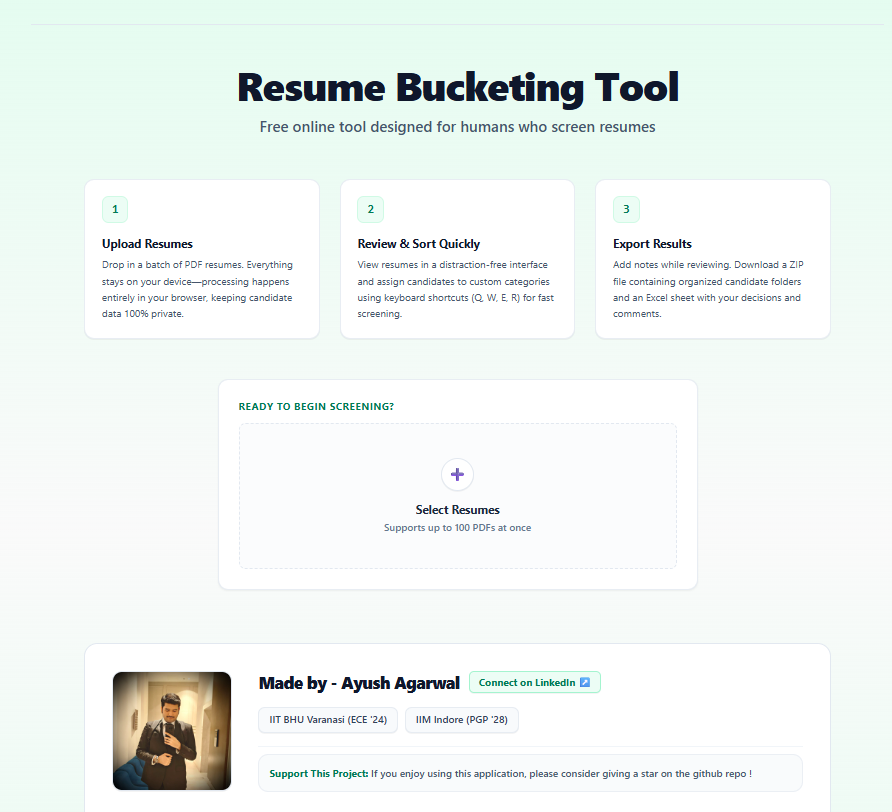
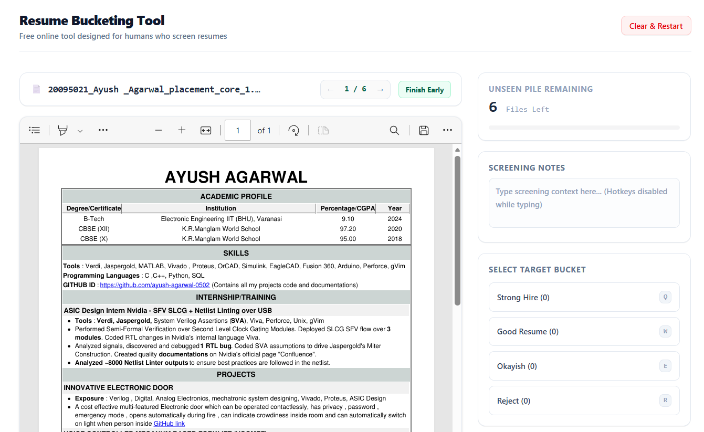

# PRD – Resume Bucket Tool – 
By – Ayush Agarwal 

[Yes, this PRD is completely written by a human, so you should read it, it is not AI slop]

## Try the tool yourself - 

https://resume-bucket-tool-ayush.vercel.app/

## The incident that gave me user insight on this invention –
 I was sorting resumes for an Indian giant company, I was marking red green orange yellow on a excel sheet itself, and realized that it was a time taking process. High user friction inspired me to think of a better UX for this problem. (These were resumes which had passed the ATS screening, and needed human check to decide whom to interview).

## The idea – 
I want to build a better UX for hiring managers, and likewise all the audience who might need to bucket resumes. 
The idea goes as follows; the user can feed upto 100 resumes on the website, which they need to sort through. They will be able to see the resumes, and put them into buckets (strong hire, can interview, okayish, clear reject) via clicking buttons. Later, the user can download the bucketed resumes. A simple clean UI UX like this would reduce the friction in switching tabs, tracking resumes etc. 

## Target Users – 
Hiring managers, HRs, Placement committees of colleges, Small business owners, and literally anyone else who needs to sort through 20-100 resumes in a day. 

## Does this not already exist ? – 
At a B2B level inside massive HR Tech softwares, yes it does exist. However, at a B2C level, there is a lack of simple tool in the market which can accomplish this. A small business, or a student club head is not going to setup a massive B2B contract just to sort 50 resumes. My inspiration comes from ilovepdf as a business, its simple, its lovely and its simply lovely. 

Also, searching online, I could find some AI screening tools (which completely overlooks the second phase of user journey, where the hiring manager themselves likes to sit and see the people), I could find “tinder for jobs” (which is aimed for applicants, while mine is aimed for hiring managers or hr), I could find resume optimization softwares (which again are for applicants, and very heavily emphasize AI etc, but are again irrelevant to the problem statement). It was a shocking realization for myself too, I did not expect this basic problem to be unsolved in the market, but it seems that it is, and myself being a techie and a product manager instinct person, I decided to solve it, and see how it goes. Goes to the show that being someone who myself faced this problem, the user empathy was a great inspiration for this project. 

## Monetization idea – 
For now I am expecting basic ad monetization using google AdSense. I do not have a huge aim with this project since I have heard that ad revenue is very less per view, and being a solo project I cant burn on marketing, however, I enjoy working on stuff like this, any incoming money could be pocket money, or in optimistic case will help me fund my upcoming MBA well. 
Ok, by the time I was done setting up the project, I realized its difficult to setup ad monetization, hence I gave up for now, and let it be a hobby project. 

## Growth Strategy – 
For now I have decided that a simple Linkedin post, and word of mouth strategy should suffice, since this is more of a hobby project. 

## Execution roadmap – 

Since I am from an AI and hardware background, so web design is not something that I consider my core competency, apart from a basic knowledge of html css, and some primer on system design. Hence I decided to apply a first principles thinking, and construct this project from scratch. I do know that I have to use some javascript framework to make this, but I am not sure of that while writing the prd. 

First, I will create a website, where someone can upload upto 100 PDF files for now. There has to be a upload button, and the person can see their files and upload it. 

Care has to be taken that the resumes will stay on the client laptop itself, I do not plan on having a heavy backend, or servers etc since they are costly. Moreover, this also serves as additional feature of privacy, since I do not plan to collect people’s data. No login page, no account making required, no database or server etc, pure frontend stuff. 

Then, another page will load, where the user can see 1 pdf at a time. They can click the arrow buttons to move from one resume to another. Additionally, in the next step we can add arrow keys to navigate through the pdfs instead of clicking the arrow button itself.  

Then I would add the buttons for the buckets, this step would also require some mechanism to keep track of the resumes that are inside a particular bucket. For now, I am planning 4 buckets – strong hire, good resume, okayish, and straight reject. If it is simple, we can add the next step as adding keyboard shortcuts q w e r so that the user can throw the resumes in the buckets even faster, instead of clicking the buttons itself. Also, we need to make sure that the buckets that are put in a bucket, are removed from the pile we are seeing. 

ResumeBucketTool.zip
├── Strong Hire
├── Good Resume
├── Okayish
├── Reject
└── Not Decided Yet

At some point, when all resumes are done, 0 pdfs would be left, we would need to show “all resumes bucketed !” too on the screen. 
Then, the next step would be to add a “Finish” button, upon clicking which, the user would get the downloaded zip file, which has the 4 folders with buckets names in it, and the folders would be containing the resume pdfs too. Very neat output folder it is. 
Now, next step would be to add a “Not decided yet” bucket in the buckets list. This will hold the resumes which are not decided yet. This will be useful in case the user decides to click finish button before going through all the resumes. Ofc, one cannot add a resume to the “not decided yet” bucket, so it should not be clickable. 

Now that the basic functionality is built, I would also add a small quick feature of displaying the number of resumes that are there in each bucket at a given time. I think it should be reasonably easy to add as a feature. We can also add a counter, to show the number of resumes added to buckets, vs total, as this will help user understand how many resumes they are done judging and how many are left to be judged. Say the user uploaded 22 resumes at the start of this procedure, and they have put 10 in buckets, so obviously the progress bar should show 10/22. 

Then we can also add an undo button, which would reverse whatever was done to the last resume.
This was on the working side of the app. I would now need to build a home page. The application is going to be called Resume bucketing tool. That would be written on the top. This home page would explain in 3 simple steps, what this application does, most likely I will explain via images left to right. It would be saying something like – “Want to bucket resumes ? You are at the right page !”. Tbh I’m still not sure what is it that the front page will say exactly, that is tbd. I want to explain in 1-2 lines what is the exact problem this website is solving, so that it simply clicks to the person who landed on this page.  And ofc there will be a upload button to upload the resumes in bulk there, which we had roughly made in the first step itself. 
Then on the bottom end of the homepage, I would add my own details, why I made this project, how it will fund my mba, and how we focus on privacy – resumes stay on your device. 

Next step would be to figure out how to use google adsense, to show ads and to earn money.  I will try to add maybe a simple banner at the bottom, not too distracting, and yet earning enough. 
Then I want to add analytics, to be able to show the number of visitors on the site, the dau mau etc no of visitors this momth this day etc , since we don’t have a database im not sure how this will work, but google analytics or vercel analytics was suggested by my llm peer. 

Future versions – 

Future version of this project can also have added functionality such as bucket renaming ability, as well as ability to add ranks to each of the resume inside a bucket, which I can implement by adding bucket name and rank to each of the resume filename while downloading, and offering a sliding ranking UI for it. Moreover, I can add a feature where user can attach notes with the resume too, and they will get those notes in excel at the end, so that they remember the basis they took their decision. 
Also need to think of the correct design color scheme and all for it. And we need to add few SEO keywords in the metadata like “free online pdf bucket bucketing tool” etc
Add a buy me a coffee link at the end 

## Deployment – 

The deployment will happen via github actions I believe but Im not sure as I have never used it. Ofc the code will be stored on github. Code being public, it would be open source, and open to inspection so that people trust it more, however I am slightly worried about people copying my project. And I plan to host the website on vercel for now, tho I am not aware of whether I can just simply host it on github instead or not, since after all this is mostly frontend project, no backend. So I am not sure about the deployment phase. Will learn and do. 
Will also have to add a licence file on Github for it. 

## Commentary for self learning while building – 

(gotta be fun reading this as its literally a python dev figuring out website building stuff) - 

Vite and React are like 2 libraries in Javascript, I don’t choose one, I have to use both. 
Node is the handler in all javascript world, npm is node package manager just like how I had pip in python.
Tailwind css is needed for decoration.
To install node - 
https://nodejs.org/en/download
Vite (pronounced veet like French word) – docs - https://vite.dev/guide/
https://www.npmjs.com/package/vite
Node is the engine that helps run js. Javascript is the coding language. Node to js is like how gcc or mingw as engines to c++.
Installing Tailwind CSS with Vite - Tailwind CSS
https://react.dev/learn
wow the pdf uploading and rendering onto the website was so smooth, I was thinking pata nahi kitna hard hoga, and it was so chilled, js is cool. 
In 2 nights (approx. 3-4 hrs of effort), while I may not know the exact contents, I managed to keep it bug free, and the main functionality is working. Idk if its mainstream, but my method is going to be the standard for vibe coding in future. Breaking into smallest instructions, and then testing manually at each step (and no ai can check cause if ai already knew what to build it wouldn’t have made the mistake, so always human to check and give context).
Uhh the app is above 100 mbs, so the node modules is the heavy thing, now I guess I understand why apps apk files are light, but the installed apps are larger in size typically on phones. 

 

 
